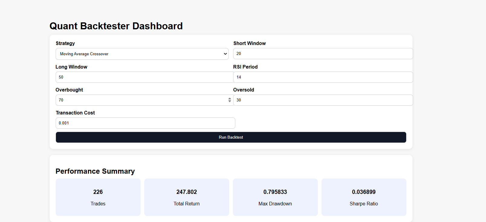
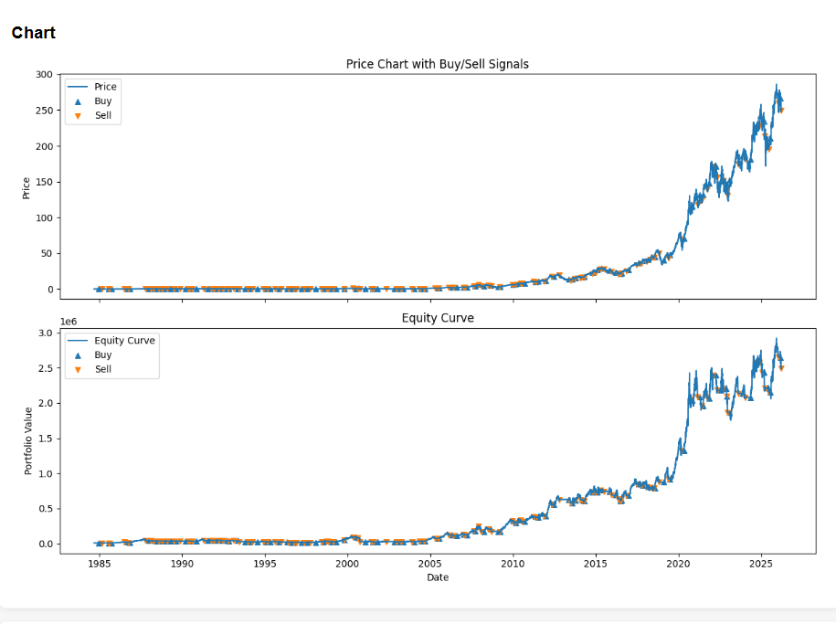

# 📈 Quantitative Trading Research Platform

A full-stack quantitative trading research platform built with C++ (execution engine), Python (analytics), and FastAPI (interactive dashboard).

---

## 🚀 Features

* ⚙️ C++ Backtesting Engine (high-performance)
* 📊 Multiple Strategies (Moving Average, RSI)
* 🔁 Event-driven execution logic
* 💰 Transaction cost modeling (realistic simulation)
* 🧠 Parameter tuning (grid search optimization)
* 📉 Performance metrics (Sharpe Ratio, Max Drawdown, Returns)
* 🐍 Python visualization (equity curve, analysis)
* 🌐 FastAPI web dashboard for interactive experiments

---

## 📊 Dashboard



---

## 📈 Strategy Results



---

## 🛠️ Tech Stack

* C++ → Core engine
* Python → Data analysis & visualization
* FastAPI → Backend API
* HTML/CSS/JS → Frontend dashboard

---

## ⚡ How It Works

1. Load historical market data (OHLC)
2. Generate strategy signals (MA / RSI)
3. Run backtest in C++ engine
4. Compute performance metrics
5. Visualize results via Python + dashboard

---

## 🧠 Strategy Logic

* **Moving Average Crossover**
  Buy when short-term MA crosses above long-term MA
  Sell when it crosses below

* **RSI Strategy**
  Buy when RSI < 30 (oversold)
  Sell when RSI > 70 (overbought)

---

## ▶️ How to Run

### 1. Build C++ Backtester

```bash
mkdir build
cd build
cmake ..
cmake --build .
./quant_backtester
```

### 2. Run Python Visualization

```bash
python plots/plot_results.py
```

### 3. Run Web Dashboard

```bash
uvicorn app:app --reload
```

Open in browser:
http://127.0.0.1:8000

---

## 📂 Project Structure

```
quant-backtester/
│── src/            # C++ source files
│── include/        # Header files
│── data/           # Input market data
│── output/         # Backtest results
│── plots/          # Python visualization
│── templates/      # HTML frontend
│── static/         # CSS/JS files
│── app.py          # FastAPI backend
│── README.md
```

---

## 🎯 Key Highlights

* Built a custom backtesting engine from scratch (no libraries)
* Designed modular strategy system
* Integrated full-stack dashboard for usability
* Focus on realism (transaction costs, execution logic)

---

## 💼 Use Case

This project demonstrates skills in:

* Quantitative finance
* Systems programming (C++)
* Backend development (FastAPI)
* Data analysis & visualization

---

## 📌 Future Improvements

* Live data integration
* Portfolio optimization
* Risk management module
